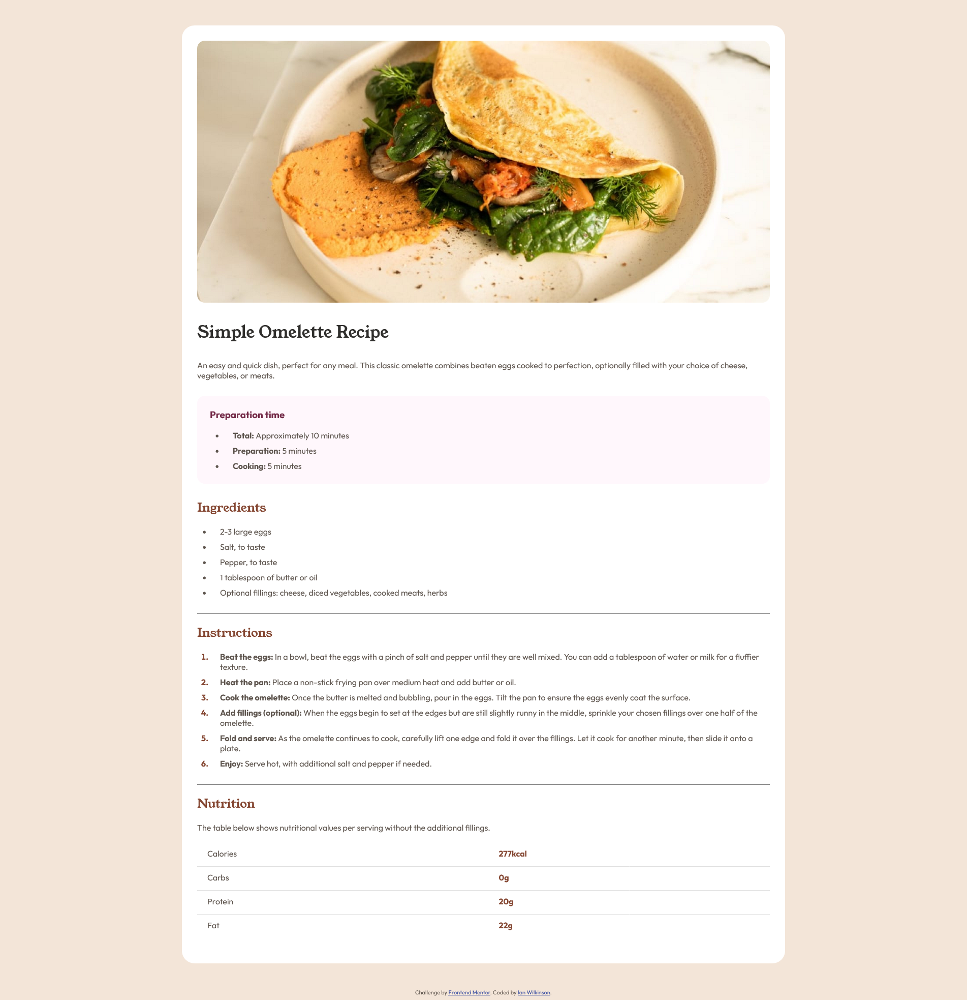
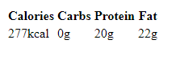
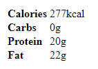

# Frontend Mentor - Recipe page solution

This is a solution to the [Recipe page challenge on Frontend Mentor](https://www.frontendmentor.io/challenges/recipe-page-KiTsR8QQKm). Frontend Mentor challenges help you improve your coding skills by building realistic projects. 

## Table of contents

- [Overview](#overview)
  - [Screenshot](#screenshot)
  - [Links](#links)
- [My process](#my-process)
  - [Built with](#built-with)
  - [What I learned](#what-i-learned)
  - [Useful resources](#useful-resources)
- [Author](#author)


## Overview

### Screenshot




### Links

- Solution URL: [Add solution URL here](https://your-solution-url.com)
- Live Site URL: [Add live site URL here](https://your-live-site-url.com)

## My process

### Built with

- Semantic HTML5 markup
- CSS

### What I learned

```div``` vs. ```section```:
- A ```div```, aka a "division" is a generic container used to group elements together for styling purposes or JavaScript manipulation.
- A ```section``` is container meant to group things with a similar theme. Ex. A ```section``` might be a chapter, header, footer, or other thematic group of content. As a result, unlike a ```div```, a ```section``` has semantic meaning that conveys the structure of the document to humans
- Both are meant for structuring and organizing content but they have different purposes and semantic meanings

Custom fonts:
- To use a custom font in an html file
  1. Create an fonts folder
  2. Create a folder inside the fonts folder with the name of your font
  3. Paste the unzipped font files in the folder from step 2. 
  4. In your index.css file:
  ```css
  @font-face {
    font-family: 'Test-font'; /* Created a font-family called 'Test font' */
    src: url('./fonts/test-font/testfont.ttf'); /* Path to the font's file */
    src: url('../assets/fonts/outfit/Outfit-VariableFont_wght.ttf') format('truetype'); /* Path to the font's file, followed by the type of file being references, in this case truetype or .ttf */
  }
  ```
  5. Use the font-family:
  ```css
  body {
    font-family: 'Test-font'; /* Optionally add fall back fonts */
  }
  ```

Inverted/Transposed Table:
- A typical layout of an html table looks as such:

| Calories    | Carbs | Protein    | Fat |
| ----------- | ----- | ---------- | --- |
| 277kcal     | 0g    | 20g        | 22g |

- An inverted/transposed table looks similar to this:

| Calories    | 277g |
| ---         | ---  |
| Carbs     | 0g | 
| Protien     | 20g |
| Fat         | 22g |

- To switch the layout of a table from the typical layout to the inverted/transposed layout we can use css:
  1. Define the html table as such:
  ```html
  <table class="inverted-table">
    <tr>
        <th>Calories</th>
        <th>Carbs</th>
        <th>Protein</th>
        <th>Fat</th>
    </tr>
    <tr>
        <td>277kcal</td>
        <td>0g</td>
        <td>20g</td>
        <td>22g</td>
    </tr>
  </table>
  ```
  So far our table looks like this:

  
  
  2. Create the following css classes:
  ```css
  .inverted-table tr > * {
      display: block; 
  }

  .inverted-table tr {
      display: table-cell;
      vertical-align: top;
      text-align: left;
  }
  ```
  Now the table looks inverted/transposed:

  


### Useful resources

- [Difference Between Div & Section in HTML](https://www.shecodes.io/athena/11438-difference-between-div-section-in-html#:~:text=div%20is%20a%20generic%20container,a%20distinct%20topic%20or%20purpose.) - This is a great article which helped me finally understand ```div``` and ```section```.
- [How To Load and Use Custom Fonts with CSS](https://www.digitalocean.com/community/tutorials/how-to-load-and-use-custom-fonts-with-css) - This helped me for learn how to use custom fonts.
- [How to invert (transpose) the rows and columns of an HTML table](https://stackoverflow.com/a/76787825) - This helped me for learn how to invert the columns/rows of an html table.


## Author

- GitHub - [ianwilk20](https://github.com/ianwilk20)

